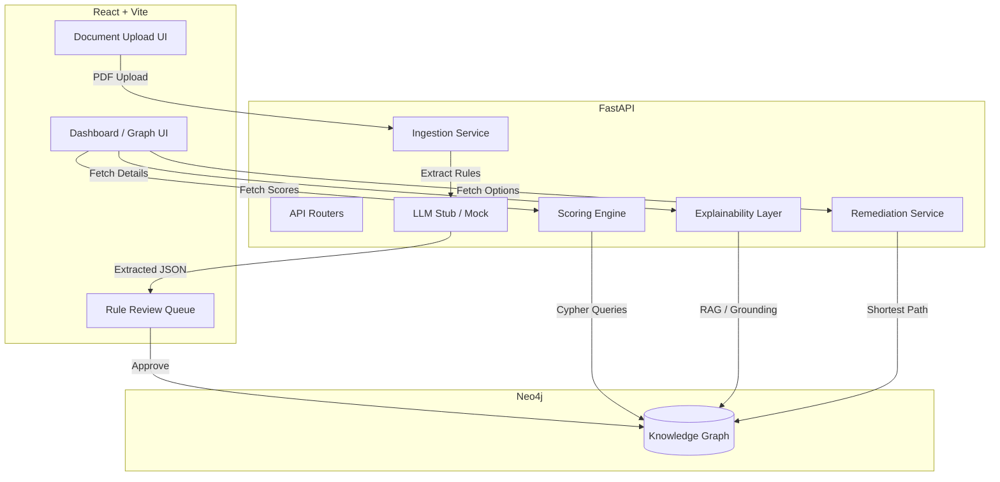

# CompatIQ Architecture

```mermaid
graph TD
    subgraph Frontend [React + Vite]
        UI[Dashboard / Graph UI]
        Upload[Document Upload UI]
        Queue[Rule Review Queue]
    end

    subgraph Backend [FastAPI]
        API[API Routers]
        Ingest[Ingestion Service]
        LLM[LLM Stub / Mock]
        Score[Scoring Engine]
        Explain[Explainability Layer]
        Remed[Remediation Service]
    end

    subgraph Database [Neo4j]
        GraphDB[(Knowledge Graph)]
    end

    %% Data Flow
    Upload -->|PDF Upload| Ingest
    Ingest -->|Extract Rules| LLM
    LLM -->|Extracted JSON| Queue
    Queue -->|Approve| GraphDB

    Score -->|Cypher Queries| GraphDB
    Explain -->|RAG / Grounding| GraphDB
    Remed -->|Shortest Path| GraphDB

    UI -->|Fetch Scores| Score
    UI -->|Fetch Details| Explain
    UI -->|Fetch Options| Remed
```
